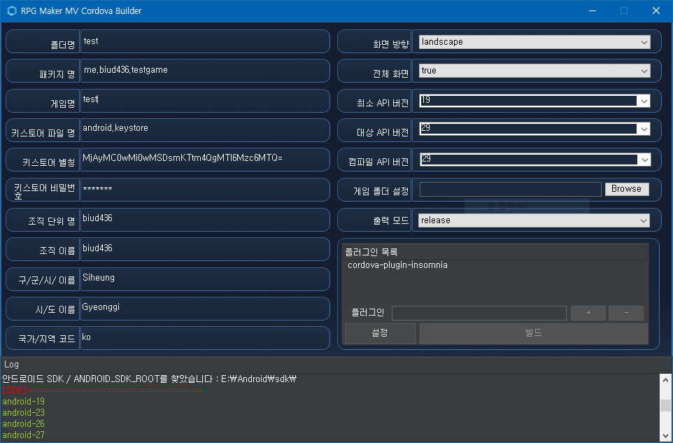

# Introduction
Cordova(코르도바)를 사용하여 RPG Maker MV용 안드로이드 앱을 빌드할 수 있게 하는 코르도바 용 GUI 빌드 프로그램입니다.

# Setup
This program didn't contain auto-installer and updater, so you need to install required programs manually. 

- Dot Net Framework v4.5.4 or more.
- Node.js (npm)
- Cordova v8.1.2 or more.
- JDK 8
- Android Studio & Android SDK 27 or more.
- Windows 7 or more.

[DOWNLOAD](https://github.com/biud436/MV-App-Builder/releases)
